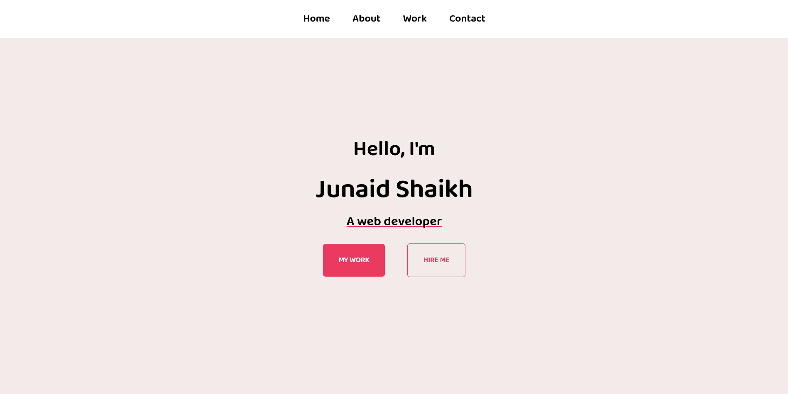

# FreeCodeCamp - Personal Portfolio Webpage

This is a solution to the [Build a Personal Portfolio Webpage](https://www.freecodecamp.org/learn/responsive-web-design/responsive-web-design-projects/build-a-personal-portfolio-webpage).  

## Table of contents

- [Overview](#overview)
  - [The challenge](#the-challenge)
  - [Screenshot](#screenshot)
  - [Links](#links)
- [My process](#my-process)
  - [Built with](#built-with)
  - [What I learned](#what-i-learned)
- [Author](#author)

## Overview

### The challenge

The challenge is to fulfill the user-stories given in the challenge and build a personal portfolio webpage.
### Screenshot



### Links

- Solution URL: [Solution](https://github.com/junaidshaikh-js/personal-portfolio)
- Live Site URL: [Live Site](https://junaidshaikh-js.github.io/personal-portfolio/)

## My process

### Built with

- Semantic HTML5 markup
- CSS custom properties
- CSS Flexbox
- Media queries to make responsive webpage

### What I learned

Build personal portfolio is the last challenge for certification course of [Responsive Web Design](https://www.freecodecamp.org/learn/responsive-web-design/). I really enjoyed doing this challenge and this is my favourite one. The use of flexbox helped me to make this webpage responsive. I learned how to link section in single webpage, use of ```transition``` property, I also got familiar with differet timing functions.

## Author

- Linkedin Profile - [Junaid Shaikh](https://www.linkedin.com/in/junaidshaikhjs/)
